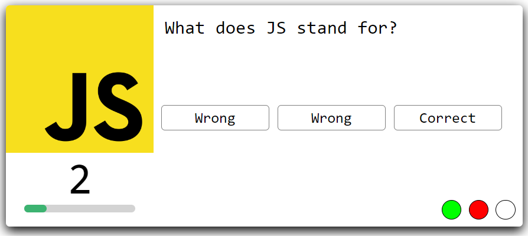

# Multiple-Choice-Quiz-JavaScript

This is a JavaScript-based multiple-choice quiz. In this quiz, users will be presented with three answer choices and must select the correct one within a 10-second time limit. If a user fails to answer within the allotted time, the quiz will automatically move on to the next question and mark the current question as incorrect. Additionally, there will be a progress bar to display the total number of questions and indicate whether the user answered each question correctly or not.


## Features

- The user is given three questions.
- A time limit to answer.
- Progress bar.
- Score tracking.

## How to Play

- Select the correct answer and move to the next question
- Don't answer within 10 seconds and move to the next question
- *Score is displayed at the end

## Installation

1. Clone this repository to your local machine:

   ```bash
   git clone https://github.com/TechnoAndy/Multiple-Choice-Quiz-JavaScript

## Acknowledgments

- Code Explained for the amazing video tutorials, check out the videos here https://www.youtube.com/@CodeExplained. 


